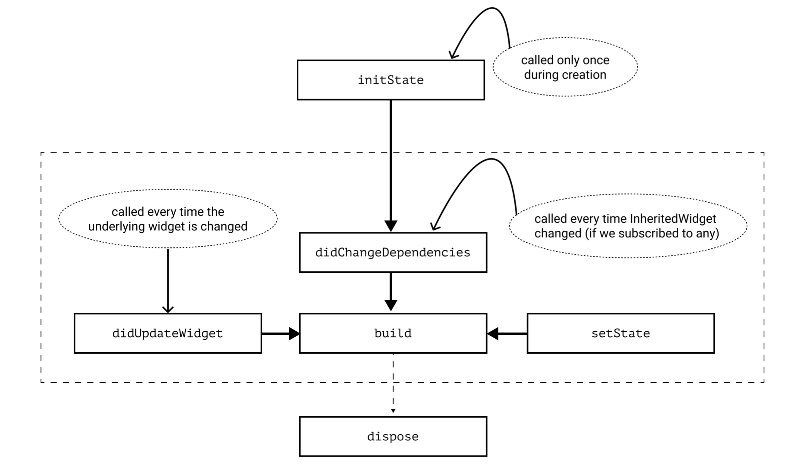
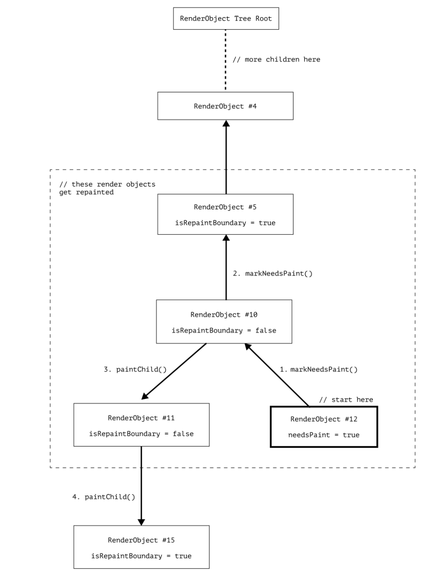

# Best Practices for Building UIs with Flutter

Flutter is rapidly becoming a go-to framework for creating applications of various scales.

In this chapter, we’re going to cover the following main topics:

- Understanding the difference between declarative 0 - and imperative UI design.
- Everything is a widget! Or is it?
- Reduce, reuse, recycle!

## Understanding the difference between declarative and imperative UI design

선언적 UI와 명령적 UI의 차이

### Understanding the imperative paradigm

By definition, the imperative programming paradigm focuses on how to achieve the desired result.
You describe the process step by step and have complete control of the process. For example, it could
result in code such as this:

```kotlin
fun setErrorState(errorText: String) {
    val textView = findViewById<TextView>(R.id.error_text_view)
    textView.text = errorText
    textView.setTextColor(Color.RED)
    textView.visibility = View.VISIBLE

    val button = findViewById<Button>(R.id.submit_button)
    button.isEnabled = true
    val progressView = findViewById<ProgressBar>(R.id.progress_view)
    progressView.visibility = View.GONE
}
```

In the preceding snippet, we imperatively described how to update the UI in case of an error. We
accessed the UI elements step by step and mutated their fields.

This is a real example of code that could’ve been written for a native Android application. Even though
this approach may be powerful and gives the developer fine-grained control over the flow of the logic,
it comes with the possibility of the following problems:

- The more elements that can change their presentation based on a state change, the more
  mutations you need to handle. You can easily imagine how this simple setErrorState
  becomes cumbersome as more fields need to be hidden or changed. The approach also assumes
  that there are similar methods for handling a progress and success state. Code such as this may
  easily become hard to manage, especially as the amount of views in your app grows and the
  state becomes more complex.

- Modifying the global state can produce side effects. On every such change, we mutate the same
  UI element and possibly call other methods that also mutate the same elements. The resulting
  myriad of nested conditionals can quickly lead to inconsistency and illegal states in the final
  view that the user sees. Such bugs tend to manifest only when certain conditions are met, which
  makes them even harder to reproduce and debug.

For many years, the imperative approach was the only way to go. Thankfully, native mobile frameworks
have since started adopting declarative toolkits. Although these are great, developers who need to
switch between paradigms inside of one project can encounter many challenges. Different tools require
different skills and in order to be productive, the developer needs to be experienced with both. More
attention needs to be paid to make sure that the application that is created with various approaches
is consistent. While the new toolkits are in the process of wider adoption, some time and effort are
required until they are able to fully implement what their predecessors already have. Thankfully,
Flutter embraced declarative from the start.

### Understanding the declarative paradigm

선언적 패러다임 이해하기

In an imperative approach, the focus is on the “how.” However, in the declarative approach, the focus
is on the “what.”
The developer describes the desired outcome, and the framework takes care of the
implementation details. Since the details are abstracted by the framework, the developer has less
control and has to conform to more rules

Yet the benefit of this is the elimination of the problems imposed by the imperative approach, such as excessive code and possible side effects. Let’s take a look
at the following example:

```dart
Widget build(BuildContext context) {
    final isError = false;
    final isProgress = true;
    return Column(
    children: [
        MyContentView(
           showError: isError,
        ),
        Visibility(
            visible: isProgress,
            child: Center(
                child: CircularProgressIndicator(),
                ),
            ),
        ],
    );
}
```

In the preceding code, we have built a UI as a reaction to state changes (such as the isError or
isProgress fields). In the upcoming chapters, you will learn how to elegantly handle the state, but
for now, you only need to understand the concept.
This approach can also be called reactive, since the widget tree updates itself as a reaction to a change
of state.

### Does Flutter use the declarative or imperative paradigm?

Flutter는 선언적 혹은 명령적 패러다임을 사용하나요?

It is important to understand that Flutter is a complex framework. Conforming to just one programming
paradigm wouldn’t be practical, since it would make a lot of things harder. For example, a purely declarative approach with its natural nesting of code
would, make describing a Container or Chip widget unreadable. It would also make it more
complicated to manage all of their states.

Here’s an excerpt from the build method of the Container describing how to build the child
widget imperatively:

```dart
@override
Widget build(BuildContext context) {
    Widget? current = child;
    // ...
    if (color != null) {
    current = ColoredBox(color: color!, child: current);
    }
    if (margin != null) {
    current = Padding(padding: margin!, child: current);
    }
    // ...
}
```

Even though the main approach of describing the widget tree can be viewed as declarative, imperative
programming can be used when it feels less awkward to do so. This is why understanding the concepts,
patterns, and paradigms is crucial to creating the most efficient, maintainable, and scalable solutions.

If you are coming from an imperative background, getting used to the declarative approach of building
the UI may be mind-bending at first. However, shifting your focus from “how” to “what” you’re trying
to build will help. Flutter can help you too, as instead of mutating each part of the UI separately, Flutter
rebuilds the entire widget tree as a reaction to state changes. Yet the framework still maintains snappy
performance, and developers usually don’t need to think about it much.

### Everything is a widget! Or is it?

At first glance, the answer
might seem simple: a widget is a basic building block of UI, and everything you see on the screen is a
widget. While this is true, these statements don’t provide much insight into the internals of a widget.

The framework does a good job of abstracting those details away from the developer. However, as
your app grows in size and complexity, if you don’t follow best performance practices, you may start
encountering issues related to frame drop. Before this can happen, let’s learn about the Flutter build
system and how to make the most of it.

What is a widget?
For most of our development, we will create widgets that extend StatelessWidget or
StatefulWidget. The following is the code for these:

```dart
abstract class StatelessWidget extends Widget {...}
abstract class StatefulWidget extends Widget {...}
@immutable
abstract class Widget {...}
```

From the source code, we can see that both of these widgets are abstract classes and that they inherit
from the same class: the Widget class.

Another important place where we see the Widget class is in our build method:

```dart
Widget build(BuildContext context) {...}
```

This is probably the most overridden method in a Flutter application. We override it every time we
create a new widget and we know that this is the method that gets called to render the UI. But how
often is this method called? First of all, it can be called whenever the UI needs an update, either by
the developer, for example, via setState, or by the framework, for example, on an animation
ticker. Ultimately, it can be called as many times as your device can render frames in a second, which
is represented by the refresh rate of your device. It usually ranges from 60 Hz to 120 Hz. This means
that the build method can be called 60-120 times per second, which gives it 16-8 ms (1,000 ms / 60
frames-per-second = 16 ms or 1, 000 ms / 120 frames-per-second = 8 ms) to render the whole build
method of your app. If you fail to do that, this will result in a frame drop, which might mean UI jank
for the user. Usually, this doesn’t make users happy! But all developer performance optimizations
aside, surely this can’t be what’s happening? Redrawing the whole application widget tree on every
frame would certainly impact performance. This is not what happens in reality, so let’s find out how
Flutter solves this problem.

When we look at the Widget class signature, we see that it is marked with an @immutable
annotation. From a programming perspective, this means that all of the fields of this class have to be
final. So after you create an instance of this class, you can’t mutate any of its fields (collections are
different but let’s ignore this for now and return to it in Chapter 4). This is an interesting fact when
you remember that the return type of our build method is Widget and that this method can be
called up to 120 times per second. Does that mean that every time we call the build method, we will
return a completely new tree of widgets? All million of them? Well, yes and no. Depending on how
you build your widget tree and why and where it was updated, either the whole tree or only parts of it
get rebuilt. But widgets are cheap to build. They barely have any logic and mostly serve as a data class
for another Flutter tree that we will soon observe. Before we move on to this tree though, let’s take a
look at one special type of widget.

### Getting to know the RenderObjectWidget and its children

RenderObjectWidget 및 그 하위 항목에 대해 알아보기

We have already discussed that when dealing with widgets,
we mostly extend StatelessWidget
and StatefulWidget. Inside the build method of our widgets, we only compose them like
Lego bricks using the widgets already provided by the Flutter framework, such as Container and
TextFormField, or our own widgets

---

This is important!
No matter how aggressively you compose your widget tree, the widgets that are actually
responsible for the rendering will always extend the RenderObjectWidget class. Even if
you, as a developer, don’t do it explicitly, you should know that this is what is happening deeper
in the widget tree. You can always verify this by following the nesting of the build methods.

---

### Reduce, reuse, recycle!

#### Pushing rebuilds down the tree

There can be several situations when pushing the rebuilds down the tree can impact performance in a positive way.

#### Calling setState of StatefulWidget

One of the most used widgets is StatefulWidget. It’s a very convenient type of widget because
it can manage state changes and react to user interactions. Let’s take a look at the sample app that is
created every time you start a new Flutter project: the counter app. We are interested in the code of
the \_MyHomePageState class, which is the State of MyHomePage:

```dart
class _MyHomePageState extends State<MyHomePage> {
  int _counter = 0;

  void _incrementCounter() {
    setState(() {
      _counter++;
    });
  }

  @override
  Widget build(BuildContext context) {
    return Scaffold(
      appBar: AppBar(
        title: const Text('Flutter Demo Home Page'),
      ),
      body: Center(
        child: Column(
          mainAxisAlignment: MainAxisAlignment.center,
          children: <Widget>[
            const Text(
              'You have pushed the button this many times:',
            ),
            Text(
              '$_counter',
              style: Theme.of(context).textTheme.headlineMedium,
            ),
            TextButton(
              onPressed: _incrementCounter,
              child: const Text('Increase'),
            ),
          ],
        ),
      ),
    );
  }
}
```

An easy way to optimize this is to push state changes down the tree by extracting them into a smaller
widget.
For example, we can extract everything that was inside the Center widget of Scaffold
into a separate widget and call it CounterText:

```dart
class _MyHomePageState extends State<MyHomePage> {
  @override
  Widget build(BuildContext context) {
    return Scaffold(
      appBar: AppBar(
        title: const Text('Flutter Demo Home Page'),
      ),
      body: const Center(
        child: CounterText(),
      ),
    );
  }
}

class CounterText extends StatefulWidget {
  const CounterText({Key? key}) : super(key: key);

  @override
  State<CounterText> createState() => _CounterTextState();
}

class _CounterTextState extends State<CounterText> {
  int _counter = 0;

  void _incrementCounter() {
    setState(() {
      _counter++;
    });
  }

  @override
  Widget build(BuildContext context) {
    return Column(
      mainAxisAlignment: MainAxisAlignment.center,
      children: <Widget>[
        const Text(
          'You have pushed the button this many times:',
        ),
        Text(
          '$_counter',
          style: Theme.of(context).textTheme.headlineMedium,
        ),
        TextButton(
          onPressed: _incrementCounter,
          child: const Text('Increase'),
        ),
      ],
    );
  }
}
```

We haven’t changed any logic. We only took the code that was inside of the Center widget of \_
MyHomePageState and extracted it into a separate widget:CounterText.

By encapsulating the
widgets that need to be rebuilt when an internal field changes into a separate widget, we ensure that
whenever we call setState inside of the \_CounterTextState field, only the widgets returned
from the build method of \_CounterTextState get rebuilt.
The parent \_MyHomePageState
doesn’t get rebuilt, because its build method wasn’t called.
We pushed the state changes down the
widget tree, causing only smaller parts of the tree to get rebuilt, instead of the whole screen.
In real-
life app code, this scales very fast, especially if your pages are UI-heavy

#### Subscribing to InheritedWidget changes via .of(context)

By extracting the changing counter text into a separate CounterText widget in the last code
snippet, we have actually made one more optimization. The interesting line for us is Theme.
of(context).textTheme.headlineMedium. You have certainly used Theme and other
widgets, such as MediaQuery or Navigator, via the .of(context) pattern. Usually, those
widgets extend a special type of class: InheritedWidget. We will look deeper into its internals in
the state management part (Chapters 3 and 4), but for now, we are interested in two of its properties:

- Instead of creating those widgets, we will access them via static getter and use some of their
  properties. This means that they were created somewhere higher up the tree. Hence, we will
  inherit them. If they weren’t and we still try to look them up, we will get an error.

- For some of those widgets, such as Theme and MediaQuery, the .of(context) not only
  returns the instance of the widget if it finds one but also adds the calling widget to a set of its
  subscribers. When anything in this widget changes – for example, if the Theme was light and
  became dark – it will notify all of its subscribers and cause them to rebuild. So in the same way
  as with setState, if you subscribe to an InheritedWidget, changes high up in the tree
  will cause the rebuild of the whole widget tree starting from the widget that you have subscribed
  in. Push the subscription down to only those widgets that actually need it.

---

Extra performance tip
You may have used MediaQuery.of(context) in order to fetch information about the screen,
such as its size, paddings, and view insets. Whenever you call MediaQuery.of(context),
you subscribe to the whole MediaQuery widget. If you want to get updates only about the
paddings (or the size, or the view insets), you can subscribe to this specific property by calling
MediaQuery.paddingOf(context), MediaQuery.sizeOf(context), and so on.
This is because MediaQuery actually extends a specific type of InheritedWidget – the
InheritedModel widget. It allows you to subscribe only to those properties that you care
about as opposed to the whole widget, which can greatly contribute to widget rebuild optimization.

비효율적인 방식

```dart
class MyWidget extends StatelessWidget {
  @override
  Widget build(BuildContext context) {
    // 모든 MediaQuery 속성 변경에 반응하여 리빌드됨
    final mediaQuery = MediaQuery.of(context);

    return Container(
      width: mediaQuery.size.width * 0.8,
      padding: EdgeInsets.only(bottom: mediaQuery.padding.bottom),
      child: Text('Hello'),
    );
  }
}
```

최적화된 방법

```dart
class MyWidget extends StatelessWidget {
  @override
  Widget build(BuildContext context) {
    // 각각의 속성 변경에만 반응
    final size = MediaQuery.sizeOf(context);
    final padding = MediaQuery.paddingOf(context);

    return Container(
      width: size.width * 0.8,
      padding: EdgeInsets.only(bottom: padding.bottom),
      child: Text('Hello'),
    );
  }
}
```

성능 최적화 원리:

- MediaQuery.of(context)는 모든 MediaQuery 속성이 변경될 때마다 위젯을 리빌드합니다2
- 특정 속성만 사용하는 MediaQuery 메서드(sizeOf, paddingOf 등)는 해당 속성이 변경될 때만 리빌드됩니다

자주 사용되는 최적화된 메서드들:

- MediaQuery.sizeOf(context): 화면 크기만 필요할 때
- MediaQuery.paddingOf(context): 패딩값만 필요할 때
- MediaQuery.orientationOf(context): 화면 방향만 필요할 때
- MediaQuery.platformBrightnessOf(context): 밝기 모드만 필요할 때

이러한 방식을 사용하면 불필요한 리빌드를 방지하여 앱의 성능을 향상시킬 수 있습니다

---

#### Avoiding redundant rebuilds

Now that we’ve learned how to scope our trees so that only smaller sections are rebuilt, let’s find out
how to minimize the amount of those rebuilds altogether.

<b>Being mindful of the widget life cycle</b>



Here are a few things that we should care about:

- The initState method gets called only once per widget life cycle, much like the dispose method.

- The didChangeDependencies method gets called immediately after initState.

- didChangeDependencies is always called when an InheritedWiget that we subscribed to has changed. This is the implementation aspect of what we have just discussed in the previous section.

- The build method always gets called after didChangeDependencies, didUpdateWidget, and setState.

---

<b>This is important!</b>

Don’t call setState in didChangeDependencies or didUpdateWidget. Such calls
are redundant, since the framework will always call build after those methods.

---

The best performance practices in the preceding list are also the reason why it’s better to decouple your
widgets into other custom widgets rather than extract them into helper methods such as Widget
buildMyWidget(). The widgets extracted into methods still access the same context or call setState, which causes the whole encapsulating widget to rebuild, so it’s generally recommended to prefer widget classes rather than methods.

---

Flutter에서 헬퍼 메소드 대신 커스텀 위젯을 사용하는 것이 더 나은 이유를 성능 관점에서 설명하겠습니다.

헬퍼 메소드의 문제점
성능 저하 원인
부모 위젯에서 setState가 호출될 때마다 전체 build 메소드가 다시 실행되며, 이는 헬퍼 메소드도 매번 재실행된다는 것을 의미합니다. 예를 들어:

```dart
class ParentWidget extends StatefulWidget {
  @override
  Widget build(BuildContext context) {
    return Column(
      children: [
        _buildHeader(),  // 헬퍼 메소드
        _buildContent() // 헬퍼 메소드
      ]
    );
  }

  Widget _buildHeader() {
    return Text('헤더');
  }
}
```

이 경우 상태가 변경될 때마다 \_buildHeader()와 \_buildContent()가 불필요하게 재실행됩니다

<b>커스텀 위젯의 장점</b>

최적화된 리빌드
별도의 위젯으로 분리하면 Flutter가 실제로 변경이 필요한 부분만 리빌드할 수 있습니다

```dart
class HeaderWidget extends StatelessWidget {
  const HeaderWidget({Key? key}) : super(key: key);

  @override
  Widget build(BuildContext context) {
    return Text('헤더');
  }
}

class ParentWidget extends StatefulWidget {
  @override
  Widget build(BuildContext context) {
    return Column(
      children: [
        const HeaderWidget(),  // 상수 위젯
        ContentWidget()
      ]
    );
  }
}
```

추가적인 이점:

- const 생성자를 사용하면 Flutter가 불필요한 리빌드를 방지할 수 있습니다2
  위젯 테스트 작성이 더 용이해집니다
- 코드 재사용성이 향상됩니다
- 앱의 다른 부분에서도 쉽게 재사용할 수 있습니다

실제 성능 차이
애니메이션이나 ListView와 같은 복잡한 위젯을 사용할 때 성능 차이가 더욱 두드러집니다. 특히:

- 애니메이션이 있는 경우
- 대규모 리스트를 표시하는 경우
- 복잡한 UI 구조를 가진 경우

이러한 상황에서 헬퍼 메소드를 사용하면 불필요한 리빌드로 인해 CPU 사이클이 낭비되고 성능이 저하될 수 있습니다3.

---

One more important thing regarding the life cycle of the State is that once its dispose method has
been called, it will never become alive again and we will never be able to use it again. This means that
if we have acquired any resources that hold a reference to this State, such as text editing controllers,
listeners, or stream subscriptions, these should be released. Otherwise, the references to these resources
won’t let the garbage collector clean up this object, which will lead to memory leaks. Fortunately, it’s
usually very easy to release resources by calling their own dispose or close methods inside the
dispose of the State.

---

Flutter의 State 객체에서 리소스 관리와 dispose 메서드의 중요성에 대해 설명하겠습니다.

<h3>State 생명주기와 리소스 관리</h3>

<h4>dispose 메서드의 중요성</h4>
State 객체가 dispose되면 다시는 사용할 수 없으며, 이때 모든 리소스를 적절히 해제하지 않으면 메모리 누수가 발생할 수 있습니다.
<h3>주요 리소스 해제 예시</h3>
TextEditingController 해제

```dart
class MyFormState extends State<MyForm> {
  final TextEditingController _controller = TextEditingController();

  @override
  void dispose() {
    _controller.dispose(); // 컨트롤러 해제
    super.dispose();
  }

  @override
  Widget build(BuildContext context) {
    return TextField(controller: _controller);
  }
}
```

주의해야 할 리소스 목록

반드시 해제해야 하는 리소스들:

- TextEditingController
- FocusNode
- AnimationController
- StreamSubscription
- ChangeNotifier
- Timer
- WebSocket 연결
- 이벤트 리스너

메모리 누수 방지를 위한 팁
올바른 dispose 패턴:

- 모든 리소스 해제는 dispose 메서드 내에서 수행
- 리소스 해제 후 반드시 super.dispose() 호출
- nullable 변수의 경우 null 체크 후 해제

이러한 리소스 관리는 앱의 성능과 메모리 사용에 직접적인 영향을 미치므로, 항상 신중하게 처리해야 합니다.

---

#### Caching widgets implicitly

Dart has a notion of constant constructors.
We can create constant instances of classes by adding a
const keyword before the class name. But when can we do this and how can we take advantage of them in Flutter?

First of all, in order to be able to declare a const constructor, all of the fields of the class must be
marked as final and be known at compile time. Second, it means that if we create two objects via
const constructors with the same params, such as const SizedBox(height: 16), only one
instance will be created. Aside from saving some memory due to initializing fewer objects, this also
provides benefits when used in a Flutter widget tree. Let’s return to our Element class once again.

Hence, if we use const constructors, we can avoid rebuilds of whole widget subtrees. This is also sometimes referred to as caching widgets. So use const constructors whenever possible and see
whether you can extract your own widgets that can make use of const constructors, even if nested widgets can’t.
Keep in mind that you have to actually use the const constructor, not just declare it as a possibility.
For example, we have a ConstText widget that has a const constructor:

```dart
class ConstText extends StatelessWidget {
  const ConstText({super.key});

  @override
  Widget build(BuildContext context) {
    return const Text('Hello World');
  }
}
```

However, if we create an instance of this widget without using the const constructor via the const
keyword as in the following code, then we won’t get any of the benefits of the const constructor:

```dart
// Don't!
class ParentWidget extends StatelessWidget {
  const ParentWidget({Key? key}) : super(key: key);

  @override
  Widget build(BuildContext context) {
    return const ConstText(); // not const!
  }
}
```

#### Explicitly cache widgets

The same logic can be applied if the widget can’t be created with a const constructor, but can be assigned to a final field of the State.
Since you’re literally saving the pointer to the same widget instance and returning it rather than creating a new one,
it will follow the same execution path as the one we saw with const widgets.
This is one of the ways in which you can work around the Container not being const. You might do so using the following, for example:

```dart
class _MyHomePageState extends State<MyHomePage> {
  final greenContainer = Container(
    color: Colors.green,
    height: 100,
    width: 100,
  );

  @override
  Widget build(BuildContext context) {
    return Column(
      children: [
        greenContainer,
        Container(
          color: Colors.pink,
          height: 100,
          width: 100,
        ),
      ],
    );
  }
}
```

- 그린 컨테이너의 동작

  - 캐시된 인스턴스의 특징:
    greenContainer는 클래스 필드로 선언되어 있어 한 번만 생성되고 메모리에 캐시됩니다
    매 빌드마다 동일한 인스턴스가 재사용됩니다
    인스턴스가 동일하기 때문에 Flutter는 update 메서드를 호출하지 않습니다

- 핑크 컨테이너의 동작

  - 새로운 인스턴스 생성의 영향:
    핑크 컨테이너는 build 메서드 내에서 매번 새로운 인스턴스로 생성됩니다
    매 빌드마다 새로운 객체가 생성되므로 항상 리빌드됩니다
    이는 Flutter가 새로운 인스턴스를 이전 인스턴스와 다른 것으로 인식하기 때문입니다

- 성능 고려사항
  - 최적화 관점:
    그린 컨테이너 방식은 불필요한 리빌드를 방지하여 성능상 이점이 있습니다
    하지만 상태 변경이 필요한 경우에는 적절하지 않을 수 있습니다
    핑크 컨테이너 방식은 매번 새로운 인스턴스를 생성하므로 불필요한 리소스를 사용할 수 있습니다
    이러한 차이는 Flutter의 위젯 업데이트 메커니즘에서 중요한 개념이며, 상황에 따라 적절한 방식을 선택해야 합니다.

#### Avoiding redundant repaints

지금까지 우리는 위젯과 엘리먼트 트리의 불필요한 리빌드를 피하는 데 도움이 되는 팁들을 살펴보았습니다. 사실 빌드 단계는 모든 무거운 작업이 수행되는 렌더링 프로세스와 비교하면 상당히 가벼운 편입니다. Flutter는 이 단계를 최대한 최적화하지만, 우리가 인터페이스를 만드는 방식을 완전히 제어할 수는 없습니다. 따라서 이러한 최적화가 충분하지 않거나 효과적으로 작동하지 않는 경우가 있을 수 있습니다.
렌더 객체 중 하나가 자신을 다시 그리려고 할 때 어떤 일이 일어나는지 살펴보겠습니다. 우리는 이 리페인팅이 해당 특정 객체에만 국한될 것이라고 가정할 수 있습니다 - 결국 리페인트가 필요하다고 표시된 것은 그 객체뿐이니까요. 하지만 실제로는 그렇지 않습니다.
문제는 우리가 위젯 트리를 범위 지정했더라도, 렌더 객체 트리는 자체적인 관계를 가지고 있다는 것입니다. 렌더 객체가 리페인트가 필요하다고 표시되면, 자신만 다시 그리는 것이 아니라 부모에게도 리페인트 표시를 하도록 요청합니다. 그 부모는 다시 자신의 부모에게 요청하고, 이런 식으로 최상위 루트까지 계속됩니다. 그리고 실제 페인팅을 할 때는 해당 객체의 모든 하위 항목도 다시 그립니다. 이는 프레임워크가 리페인트 경계(repaint boundary)라고 알려진 것을 만날 때까지 계속됩니다. 리페인트 경계는 "여기서 멈추세요, 더 이상 리페인트할 것이 없습니다"라고 말하는 Flutter의 방식입니다. 이는 위젯을 다른 위젯으로 감싸서 수행됩니다 - 네, RepaintBoundary 위젯입니다.



1. RenderObject #12에서 시작하는데, 이는 처음으로 리페인트가 필요하다고 표시된 객체입니다.
2. 이 객체는 RenderObject #10의 parent.markNeedsPaint를 호출합니다. isRepaintBoundary 필드가 false이기 때문에, needsPaint가 true로 설정되고 같은 작업을 자신의 부모에게도 요청합니다.
3. RenderObject #5의 isRepaintBoundary 값이 true이므로, needsPaint는 false로 유지되고 부모 마킹이 바로 여기서 중단됩니다.
4. 그런 다음 실제 페인팅 단계가 needsPaint로 표시된 최상위 위젯에서 시작됩니다. 이는 자식들을 순회합니다. RenderObject #11의 isRepaintBoundary가 false이므로, 계속해서 더 아래로 순회합니다.
5. 하지만 RenderObject #15의 isRepaintBoundary가 true이므로, 이 지점에서 프로세스가 중단됩니다.

그래서 우리는 결국 렌더링 객체 #10, #11, #12를 다시 칠하게 됩니다.

Let’s take a look at an example where a RepaintBoundary widget can be useful – in a ListView.
This is the simplified version of the ListView source code:

```dart
class ListView {
  ListView({
    super.key,
    bool addRepaintBoundaries = true,
    // many more params
  });

  @override
  Widget? build(BuildContext context, int index) {
    if (addRepaintBoundaries) {
      child = RepaintBoundary(child: child);
    }
    return child;
  }
}
```

ListView 생성자는 생성자에서 addRepaintBoundaries 매개변수를 받으며, 기본값은 true입니다. 나중에 자식들을 빌드할 때, ListView는 이 플래그를 확인하고, true인 경우 자식 위젯을 RepaintBoundary 위젯으로 감쌉니다. 이는 스크롤하는 동안 리스트 아이템들이 다시 그려지지 않는다는 것을 의미하며, 이는 아이템들의 표현이 아닌 오프셋만 변경되기 때문에 합리적입니다. RepaintBoundary 위젯은 무겁지만 정적인 위젯이 있는 경우나, 스크롤링, 전환 또는 다른 애니메이션과 같이 화면상의 위치만 변경되는 경우에 매우 효율적일 수 있습니다. 하지만, 다른 많은 것들처럼 이것도 트레이드오프가 있습니다. 화면에 최종 결과를 표시하기 위해서는 위젯 트리 그리기 명령을 실제 픽셀 데이터로 변환해야 합니다. 이 과정을 래스터화라고 합니다. RepaintBoundary는 래스터화된 픽셀 값을 메모리에 캐시하기로 결정할 수 있는데, 이 메모리는 무한하지 않습니다. 너무 많은 RepaintBoundary는 역설적으로 성능 문제를 일으킬 수 있습니다.
또한 RepaintBoundary가 여러분의 경우에 유용한지 판단할 수 있는 좋은 방법이 있습니다. Flutter 인스펙터 도구를 통해 renderObject의 diagnosis 필드를 확인하세요. 만약 "This is an outstandingly useful repaint boundary"와 같은 내용이 표시된다면, 이를 유지하는 것이 좋은 선택일 것입니다.

#### Optimizing scroll view performance

There are two important tips for optimizing scroll view performance:

- First, if you want to build a list of homogeneous items, the most efficient way to do so is by
  using the ListView.builder constructor. The beauty of this approach is that at any given
  time, by using the itemBuilder callback that you’ve specified, the ListView will render
  only those items that can actually be seen on the screen (and a tiny bit more, as determined by
  the cacheExtent). This means that if you have 1,000 items in your data list, you don’t need
  to worry about all 1,000 of them being rendered on the screen at once – unless you have set
  the shrinkWrap property to true

- This leads us to the second tip: the shrinkWrap property (available for various scroll views)
  forces the scroll view to calculate the layout of all its children, defeating the purpose of lazy
  loading. It’s often used as a quick fix for overflow errors, but there are usually better ways to
  address those errors without compromising performance. We’ll cover how to avoid overflow
  errors while maintaining performance in the next chapter.

#### Summary

이 장에서는 Widget, Element 및 RenderObject 트리 간의 관계를 살펴보았습니다. StatefulWidget의 범위를 지정하고 상속된 위젯에 대한 구독을 통해 Widget과 Element 트리의 리빌드를 피하는 방법과, const 생성자와 final 초기화를 통해 위젯을 캐싱하는 방법을 배웠습니다. 또한 렌더 객체 서브트리의 리페인트를 제한하는 방법과 스크롤 뷰를 효과적으로 다루는 방법도 배웠습니다.
2장에서는 이미 성능이 좋은 인터페이스를 계속 늘어나는 다양한 기기에서 반응형으로 만드는 방법을 살펴볼 것입니다. Flutter에서 크기 조정과 레이아웃이 어떻게 작동하는지, 오버플로우 에러를 어떻게 수정하는지, 그리고 모든 사용자가 애플리케이션을 사용할 수 있도록 보장하는 방법을 다룰 것입니다.
